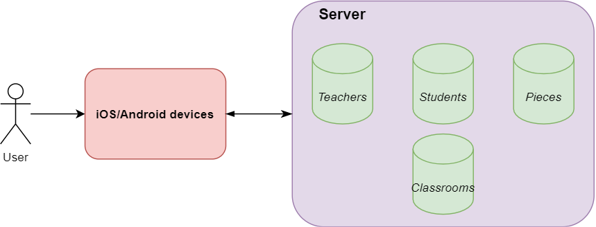

# Piano Practice Application
An application that uses spaced repetition to dynamically plan and schedule practice routines.

 

## **Overview**

  Client: Anna Sibley 

  Organisation: Bristol Music School

This application is intended to assist piano teachers with monitoring the number of times the student practices in addition to automatically creating a practice routine for each week. It will also be designed to provide motivation for young students to practice every day by rewarding them each time they do so. 

The teacher will be able to view the student’s account and make changes to their current practice routine, and the student will log the pieces they have “reviewed” (practised), under the supervision of their parents, at the end of every practice session. 

The selection of pieces is in line with the Suzuki method.

## **Features**

### __Dynamic scheduling__ 
  Using the feedback the teacher provides at the end of every lesson, the system decides when to schedule the next review. At this point, the teacher has two choices:

  *   **Continue**
    There is no change and the scheduled reviews (of “learnt” pieces) are added, if review limit is below a certain threshold, and pushed to the next available slot (which is at least a week later if lessons are weekly) otherwise.

  *   **Add new pieces**
    The teacher marks the piece as “learnt” and sets the difficulty of the piece (easy, medium, or hard) and the next review is scheduled accordingly. For example, the next possible slot is at least 1 week away if the piece is marked as “hard”.
    The new piece is then added to next week’s routine.
    The teacher can also add, delete, and delay scheduled reviews. 

### __Engaging interface__ 
  Since the system will be used by children as well, it needs to appeal to, and hence, encourage the student to practise. We intend to do this by rewarding them with in-game currency (coins) every time they “review” a piece which they can use to buy items in the store. In the future, we could expand on this by adding a leader board consisting of other students and the amount of coins they earned that week.

 

## **Requirements**

 

### __Stakeholders__
*   **Anna Sibley:** Since the idea for the project was given by Anna Sibley, the founder of Bristol Music School, she has full control over the development of the project.
*   **Piano teachers:** This app is meant to be a tool for piano teachers so the functionality will be designed to make it easier for them to track and guide the student’s progress
*   **Students:** The students will be using this app to log their practice sessions 
*   **Parents:** As the app is aimed at children, the parents would need to supervise them while they practice
*   **Google Play Store:** This app will be published on the Google Play Store, so it will need to conform to all the required rules and regulations

 

### **User Stories**
#### **Piano teachers**
 

_"As a __piano teacher__, I want to be able to __track my student’s weekly reviews at any time__ so that I can __plan ahead for the week’s lesson__”_

*  The student practices and logs each review
*  The teacher is provided with up-to-date data of the student’s current practice routine and progress

 

_“As a __piano teacher__, I want to be able to __modify my student’s weekly practice routine at any time__ so that I can __add new pieces__”_

*  At the end of the week, the student performs all the pieces they practised during the week
*  If the teacher is satisfied with their performance:
    * 	The teacher marks the piece as “learnt”
    * 	The teacher provides feedback to the system by selecting one of the three options: easy, medium, and hard
    *   The pieces are automatically scheduled for review in the next available slot accordingly
    * 	The teacher selects the next piece (or pieces) for the student to learn

*  Else, if the teacher thinks that there is room for improvement:
    * 	The teacher makes no change to the next week’s practice routine and the student continues “learning” the same pieces 

*  Changes (such as removing or adding pieces) can be made to the routine at any point

 

_“As a __piano teacher__, I want to be able to __monitor all my students’ accounts__ so that I can __customise each of their routines to fit their calibre__”_

*  Each time a new student creates an account, the teacher will send an invite to join their “classroom”
*  The student accepts the invite
*  The teacher can view the student’s profile and current practice routine
*  The classroom will consist of multiple students with different routines, and the teacher is able to view all their practice data by selecting the student’s profile

 

_“As a __piano teacher__, I want to __pause reviews and learning at any time__ so that I can __continue teaching from where I left off after the holidays__”_

*  The teacher views the student’s current practice routine and has the option to:

    *   **Pause learning:** All the pieces being “learned” in the current routine are temporarily removed 
    *   **Pause reviews:** All the pieces being reviewed in the current routine are temporarily removed

*  When the teacher wishes to resume learning/reviews, they simply select the “Resume learning” or “Resume reviews” option
*  Pieces being learnt and pieces being reviewed are independent so learning could still take place if reviews are paused and vice versa

 

**Students**

  

_“As a __student__, I want to __have an incentive to practice__ so that I can __maximise the frequency of my practice sessions__”_
*   At the end of every review, the student is rewarded with “coins” which they can use in the store to buy items. Items could include a new character, and a power-up that boosts their post-review reward for a short amount of time.
*   Challenges or achievements can be completed to unlock special items in the store. 
*   At the end of every lesson, the teacher rewards them for their effort by giving them a “star” for that week.
*   As they gain stars they advance to a higher level and earn a new badge.

  

 _“As a __student__, I want to __review the same piece multiple times__ so that __I can improve my performance__”_

*   Each piece due for review can be reviewed any number of times before the lesson

  

_“As a __student__, I want to __spend a reasonable amount of time practising__ so that I can __enjoy my practice sessions__”_

*   After talking to the student to find the amount of time they will be able to practice every day, the teacher can set a review threshold. 
*   This will limit the number of cards marked for review and hence keep the practice sessions short as the number of “learnt” pieces increases

## __Atomic implementation features__
The atomic requirements for modifying the student’s current practice routine are as follows:
* Once the teacher logs in using their email address and password, the profiles of all students should be visible
* Once the profile is selected, the student’s current practice routine is visible. Each piece is either in the “Learning” section or the “Reviewing” section
* The teacher will be able to select one of the following actions:
    *   __Pause Learning__
        *   All pieces currently being learned will be suspended
        *   They will not appear in the practice routine until the teacher selects the “Resume Learning” option

    *   __Pause Review__
        *   The queue of pieces due for review will be frozen
        *   They will not appear in the practice routine until the teacher selects the “Resume Review” option

* Once the piece is selected, information about it is visible. This should include:
    * Piece type (“Learn” or “Review”)
    * Number of reviews in total
    * Number of reviews this week
    * Next review date	
* The teacher will be able to select one of the following actions:
        
    *   __Delete__
        *   The piece will be removed from the schedule forever and marked as deleted.
        *   The teacher is asked to confirm this action by entering their key
        *   All piece history is deleted so this cannot be undone.

    *   __Suspend__
        *   The piece is temporarily removed from the schedule 
        *   The teacher later has the option to “unsuspend” this piece
        *   All piece data is saved and “frozen”, so the piece will not be due for review unless it is “unsuspended”
        *   Once unsuspended, the piece will be pushed to the back of the review queue

* The student will receive a notification if their practice routine has been changed
* To assist the teacher, there will be a brief tutorial that can be accessed at any time that highlights the different options they have available
* To avoid accidental changes, each action will be followed by a confirmation alert that requires the teacher to enter a key
* This key can be changed like the account password by sending an email to the email address of the account
* The request to see the student profiles should be processed in less than 10 seconds
* Any updates to the routine should be uploaded and downloaded in 3 seconds for every piece changed

 

## __Personal Data, Privacy, Security and Ethics Management__
  For personal data, we will only be collecting the students’ name and age (for the leader board), as well as them having a username so they can be linked to their teachers. The teachers will only have their name collected and associated with a username. This data will be protected by passwords set by the users and stored securely. This data will not be processed outside the app apart from for school purposes, so we will be compliant with GDPR.
  We are obeying the cookie law by having the participants (or their legal guardians where applicable) agree to terms and conditions including information on how their data is used when they create their account.
  Ethics approval was applied for on __24/11/20__ at __21:41__.

 

## __Architecture__
To be made available to all students and teachers, the application should run on both Android and iOS devices. Since Flutter supports both Android and iOS development, we have chosen to use it for the development process. 
  As shown below, we will be using AWS to store the following databases:
* Teachers to store the teachers’ account information like name and email addresses
* Students to store the students’ account information like name and email addresses
* Classrooms to store unique “Classroom IDs” for each teacher
* Pieces to store information about all pieces
* We will also be using AWS to authenticate the user and query the databases.

 

 

## __Development Testing__
 Throughout the development phase of our app we will use a variety of tests to ensure all features function as intended. The two main types of tests used during development will be __‘Unit tests’__ and __‘Widget tests’__. Unit tests operate on a single method, function, or class and are used to check logic operations are computed as intended. This will often involve testing the method, function, or class under a variety of conditions. Widget tests are slightly more thorough and aim to test that a widget both functions and appears on screen as planned. This testing process makes use of a testing environment and several classes to provide a situation where a widget can be tested.

 

### __Testing our scheduling algorithm__
We have chosen this section of our app to talk about since it is fundamental to providing the correct pieces for students to review. Testing it thoroughly will ensure it functions as intended and doesn’t fail as this could negatively impact students' learning and progress; for example, if a piece far too easy or difficult is scheduled it would be a waste of the students learning time. 

 

|__Test cases__|
|---|
| A piece is only scheduled for review during that week if the number of pieces due for review is below the threshold.|
| All pieces in the “Learning” section stay the same until the teacher marks them as “learnt”.|
|Suspended pieces are never due for review.|
| Unsuspended pieces are pushed to the back of the review queue.|
| No pieces are in the “Learning” or “Reviewing” section if learning and reviewing is paused respectively.|
| A piece marked as “hard” is scheduled to the next available review slot at least a week away.|
|  A piece marked as “easy” is scheduled to the next available review slot at least 3 weeks away.|

 

## __Release Testing__
For high-level release testing we will use a testing method involving __‘Integration tests’__. These
tests work by testing the entire app or very large sections of it and aim to see whether
components and widgets are interacting with each other as intended. These tests can also be
used for performance testing/ optimisation of the app. Typically these tests are run on a real
device or emulator and are often run manually. .
Testing a user story
“As a piano teacher, I want to be able to monitor all my students’ accounts so that I can customise each of their routines to fit their calibre”
We have chosen this user story to talk about since it is a key part of the app's overall intended
purpose. Ensuring a teacher can monitor all their students and make changes to their practice
plans is essential.

 

|__Test__|__Intended outcome__|
|---|---|
|As a __teacher__, add a piece to a student’s profile for review.|The piece appears on the student’s account as one they are required to practice.|
|As a __teacher__, remove a piece from a student’s profile.|The piece is removed from the student’s list of practice pieces.|
|As a __teacher__, click on a student’s profile.|An updated student profile is displayed showing current set practice pieces and other student info.|
|As a __student__, link to a teacher using a unique teacher code.|The student is added under the teacher's list of students and the teacher is added to the student's account.|
|As a __teacher__, be able to search for a student in a list of all students.|A search for a student’s name or unique id should find them in a list.|

